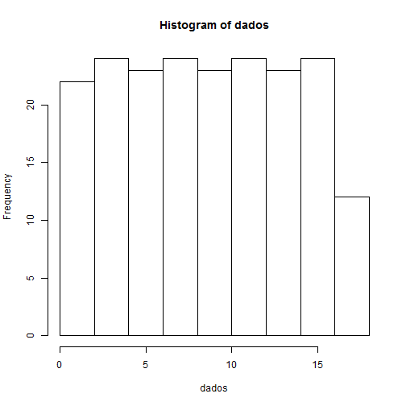

Título
========================================================
author: Pedro Nascimento de Lima
date:  
autosize: true
Elevando ao Quadrado
========================================================
Vamos Aprender a elevar ao quadrado...


```r
# Comentário no Código
a = 2
b = a^2
b
```

```
## [1] 4
```

Fazendo um histograma
========================================================
Um Histograma é fácil de fazer no R!


```r
# Comentário no Código
dados = 2:200
dados = dados*rnorm(1,mean=2,sd=2.3)
hist(dados)
```



